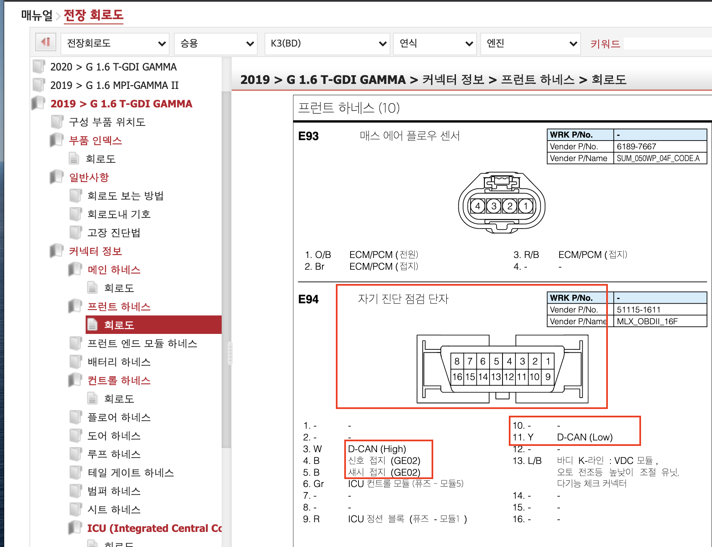
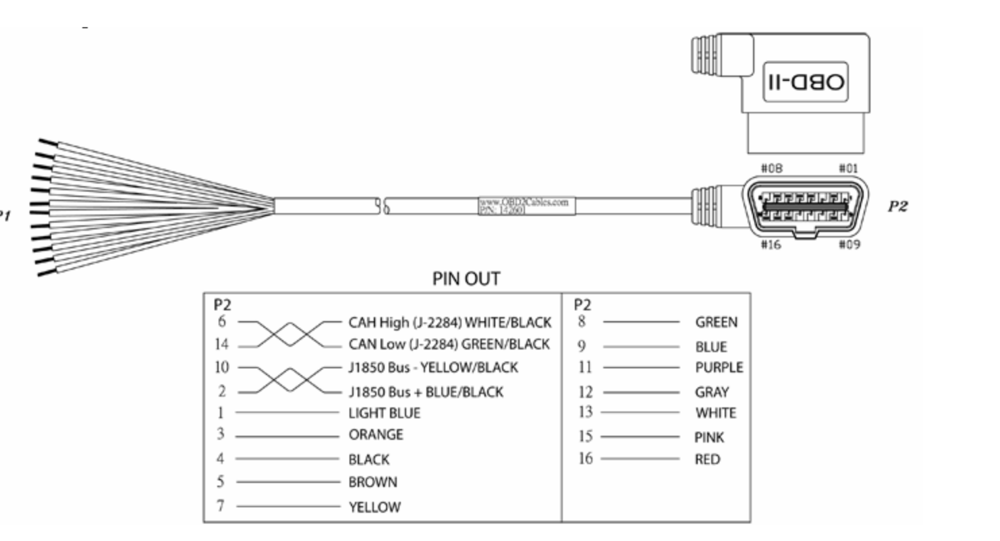
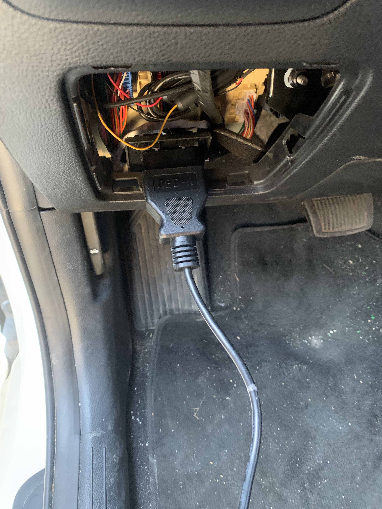

# 산기대 졸업작품 팀 레포지토리


## Cloud Realtime Dasboard

링크 : https://dashboard.driving-mate.com

## 프로모션(랜딩)페이지

링크 : https://www.driving-mate.com


## 실시간 차량 주행 정보 모니터링 (진행중)


## 전체적인 아키텍쳐


## 라즈베리 파이 내부 코드 구성

### 자동차 데이터 수집

자동차에 있는 OBD 단자를 통해 CAN 신호를 전달받는다. 이 때 CAN 신호를 `pican` 이라는 보드를 통하여 라즈베리파이가 
읽을 수 있는 신호로 변환, `python-can`라이브러리를 통하여 자동차와 OBD(can)통신을 연결함.



자가 진단 점검 단자의 3, 4, 11 핀을 활용하여 연결



OBD-2 케이블의 반대편을 잘라서, 필요한 pin(3, 4, 11)에 대한 선만 `pican` 보드에 연결




### 데이터 수집을 위한 CAN 통신(OBD) 코드 작성

OBD 프로토콜에 맞춰, 차량의 실시간 데이터를 요청하는(쿼리) 코드를 작성해야함.

#### 쿼리


#### 응답


#### 실제 구현한 코드

따라서 사용 가능한 OBD PID를 분리하고, 이 데이터를 수집하기 위한 파이썬 코드를 작성하였다.
(/greengrass/canPlugin/can_plugin.py 및 /greengrass/canPlugin/canutil.py)

- canutil.py

```python3
from enum import Enum
import can

DATA_TYPE_INDEX = 2


class NotSupportedDataTypeException(Exception):
    def __init__(self):
        super().__init__("지원하지 않는 데이터 타입입니다.")


class CanDataType(Enum):
    """
    OBD2 PIDS : https://en.wikipedia.org/wiki/OBD-II_PIDs

    차량 제조사별 확장 PID 및 다른 PID가 존재할 수 있다. 확인 필요
    """
    ENGINE_LOAD = 0x04
    SHORT_FUEL_TRIM_BANK = 0x06
    LONG_FUEL_TRIM_BANK = 0x07
    INTAKE_MANIFOLD_ABSOLUTE_PRESSURE = 0x0b
    ENGINE_RPM = 0x0C
    VEHICLE_SPEED = 0x0d
    INTAKE_AIR_TEMPERATURE = 0x0F
    MAF_SENSOR = 0x10
    THROTTLE = 0x11
    ENGINE_RUNTIME = 0x1F
    TRAVELED_DISTANCE = 0x31  # since Error code cleared !
    FUEL_TANK_LEVEL = 0x2F
    OXYGEN_SENSOR = 0x34
    AMBIENT_AIR_TEMPERATURE = 0x46
    SHORT_TERM_FUEL_EFFICIENCY = 0x00  # this is dummy
    AVERAGE_FUEL_EFFICIENCY = 0x00  # this is dummy

    # Request & Response
    PID_REQUEST = 0x7DF
    PID_REPLY = 0x7E8

    # PID MODES
    SHOW_CURRENT_DATA = 0x01
    SHOW_FREEZE_FRAME_DATA = 0x02
    SHOW_TROUBLE_CODES = 0x03


class CanRequestMessage:
    # TODO: change this class as singleton
    def __str__(self) -> str:
        return "{}".format(self.message)

    def __init__(self, data_type) -> None:
        self.data_type = data_type  # ENUM
        self.message = [0x02,
                        CanDataType.SHOW_CURRENT_DATA.value,
                        self.data_type.value,
                        0x00,
                        0x00,
                        0x00,
                        0x00,
                        0x00]

    def get_type(self):
        return self.data_type.name


class CanDataConvert:
    def __init__(self):
        pass

    @staticmethod
    def convert(recv_msg) -> int:
        data_type = recv_msg.data[DATA_TYPE_INDEX]
        try:
            handler = getattr(CalculateData, CanDataType(data_type).name.lower())
            return handler(recv_msg.data)
        except AttributeError:
            raise NotSupportedDataTypeException
        except Exception as e:
            print('error occur : ', e)


# cal fef https://www.sciencedirect.com/science/article/pii/S2352484719308649
# https://stackoverflow.com/questions/44794181/fuel-consumption-and-mileage-from-obd2-port-parameters
class CalculateData:
    maf = 0
    speed = 0
    present_fuel_efficiency = 0
    average_fuel_efficiency = 0
    count = 0
    avg_buf = 0

    def __init__(self):
        pass

    @classmethod
    def average_fuel_efficiency(cls, recv_msg) -> float:
        cls.avg_buf += cls.present_fuel_efficiency
        cls.count += 1
        cls.average_fuel_efficiency = round(avg_buf / count, 2)
        return cls.average_fuel_efficiency

    @classmethod
    def short_term_fuel_efficiency(cls, recv_msg) -> float:
        cls.present_fuel_efficiency = round(cls.speed * (1 / 3600) * (1 / cls.maf) * 14.7 * 710, 2)
        return cls.present_fuel_efficiency

    @staticmethod
    def oxygen_sensor(recv_msg) -> float:
        # we can make two data. first one is ratio, the other is mA
        return round((256 * recv_msg[3] + recv_msg[4]) * (2 / 65536), 2)

    @staticmethod
    def intake_manifold_absolute_pressure(recv_msg) -> int:
        return recv_msg[3]

    @classmethod
    def maf_sensor(cls, recv_msg) -> float:
        cal = round((recv_msg[3] * 256 + recv_msg[4]) / 100, 2)
        cls.maf = cal
        return cal

    @staticmethod
    def engine_load(recv_msg) -> float:
        return round((100 / 255) * recv_msg[3], 2)

    @staticmethod
    def engine_rpm(recv_msg) -> float:
        return round(((recv_msg[3] * 256) + recv_msg[4]) / 4, 2)

    @classmethod
    def vehicle_speed(cls, recv_msg) -> int:
        cls.speed = recv_msg[3]
        return recv_msg[3]

    @staticmethod
    def throttle(recv_msg) -> float:
        return round((recv_msg[3] * 100) / 255, 2)

    @staticmethod
    def short_fuel_trim_bank(recv_msg) -> float:
        return round(((100 / 128) * recv_msg[3]) - 100, 2)

    @staticmethod
    def long_fuel_trim_bank(recv_msg) -> float:
        return round(((100 / 128) * recv_msg[3]) - 100, 2)

    @staticmethod
    def short_fuel_trim_bank(recv_msg) -> float:
        return round(((100 / 128) * recv_msg[3]) - 100, 2)

    @staticmethod
    def intake_air_temperature(recv_msg) -> int:
        return recv_msg[3] - 40

    @staticmethod
    def throttle_position(recv_msg) -> float:
        return round((100 / 256) * recv_msg[3], 2)

    @staticmethod
    def engine_runtime(recv_msg) -> int:
        return 256 * recv_msg[3] + recv_msg[4]

    @staticmethod
    def traveled_distance(recv_msg) -> int:
        return 256 * recv_msg[3] + recv_msg[4]

    @staticmethod
    def fuel_tank_level(recv_msg) -> float:
        return round((100 / 255) * recv_msg[3], 2)

    @staticmethod
    def ambient_air_temperature(recv_msg) -> int:
        return recv_msg[3] - 40


```

`CanDataType` 이라는 Enum 클래스를 생성하여 각 PID를 관리하였고, 각 데이터 별로 응답에 대한 변환식이 다르기 때문에
변환을 담당할 클래스또한 작성하였다.

`CanDataConvert` 클래스는 각 PID에 맞게 적절한 변환식을 호출하기 위해서 응답에 맞는 `handler`를 생성하고 호출하는
형태로 구현하였다.

- can_plugin.py

```python3
import can
import os
import subprocess
from libs import util
from libs.plugin import run_plugin_thread
from collections import deque
from time import sleep
from canutil import CanDataType, CanRequestMessage, CanDataConvert
from libs.base_plugin import BasePlugin
from typing import List

TOPIC = util.get_ipc_topic()

TEST_FIELDS = [
    'engine_load',
    'engine_rpm',
    'intake_manifold_absolute_pressure',
    'vehicle_speed',
    'throttle',
    'short_fuel_trim_bank',
    'engine_runtime',
    'traveled_distance',
    'fuel_tank_level',
    'ambient_air_temperature',
    'maf_sensor',
    'oxygen_sensor',
    'short_term_fuel_efficiency',
    'average_fuel_efficiency'
]

OPTION = {
    'channel': 'can0',
    'busType': 'socketcan_native'
}

INIT_COMMAND = '/sbin/ip link set can0 up type can bitrate 500000'


class SocketCanInitFailedException(Exception):
    def __init__(self):
        super().__init__('소켓 캔 초기화 패')


class CanPlugin(BasePlugin):
    # TODO: inherite base class and refactor below methods !
    def __init__(self, fields: List[str], option=None) -> None:
        super().__init__(fields, option=option)
        self.data_list = [
            x.upper() for x in fields
        ]
        self.enum_list = [
            getattr(CanDataType, x) for x in self.data_list
        ]
        self.req_messages_for_data = [
            getattr(CanRequestMessage(x), 'message') for x in self.enum_list
        ]
        self.data_len = len(self.data_list)
        self.recv_buffer = deque()
        self.return_buffer = deque()
        self._channel = option.get('channel', 'can0')
        self._bus_type = option.get('busType', 'socketcan_native')
        self._init_can()
        self.bus = can.interface.Bus(channel=self._channel, bustype=self._bus_type)

    def _init_can(self) -> None:
        os.system(INIT_COMMAND)
        print('socket can init complete')

    # TODO:
    # 1. set return_buffer & recv_buffer with property

    def _send_request(self):
        self.return_buffer.clear()
        print("버퍼 초기화")

        def is_valid_reply(message) -> bool:
            if message.arbitration_id != CanDataType.PID_REPLY.value:
                return False
            else:
                return True

        for message in self.req_messages_for_data:
            msg = can.Message(arbitration_id=CanDataType.PID_REQUEST.value, data=message, extended_id=False)
            #           print("this is will send can msg " , msg)
            self.bus.send(msg)
            sleep(0.01)
            while True:
                recv_data = self.bus.recv()
                if is_valid_reply(recv_data):
                    self.recv_buffer.append(recv_data)
                    break
                sleep(0.01)
                continue
        while len(self.recv_buffer) < self.data_len:
            recv_data = self.bus.recv()
            if is_valid_reply(recv_data):
                self.recv_buffer.append(recv_data)
        while self.recv_buffer:
            self.return_buffer.append(
                CanDataConvert.convert(
                    self.recv_buffer.popleft()
                )
            )

        return self.return_buffer

    def collect_data(self) -> None:
        try:
            self.data = list(self._send_request())
        except Exception as e:
            print('error occured when collect data ', e)

    # TODO : Calculate Fuel Efficiency before relay.
    def cal_fuel_efficiency(self):
        """
        https://stackoverflow.com/questions/44794181/fuel-consumption-and-mileage-from-obd2-port-parameters
        """
        maf = self.data[self.data_list.index('MAF_SENSOR')]
        speed = self.data[self.data_list.index('VEHICLE_SPEED')]

        fuel_efficiency = speed * (1/3600) * (1/maf) * 14.7 * 710

        return fuel_efficiency


def handler(event, context) -> None:
    pass


try:
    cp = CanPlugin(TEST_FIELDS, OPTION)
except Exception as e:
    print('failed to make can plugin :', e)


def run():
    run_plugin_thread(cp.entry)


if __name__ == '__main__':
    pass
else:
    run()

```

필요한 데이터를 호출하고, 응답하는 과정에서 우리가 원하는 데이터가 아닌경우 버리는 로직을 구성하였다.

데이터를 호출하는 코드를 한번 수행하고, 원하는 응답이 올 때 까지 기다리는 로직이 존재하며, 이 데이터들을 `deque`로 관리하여
데이터를 수집/저장 하는 과정에서의 불필요한 시간복잡도를 줄이고자 노력했다. (큰 의미는 없는 것 같다.)

### 수집한 데이터 송신 부분(실시간 앱 / mqtt / S3 등)

이렇게 수집된 데이터들은 모두 `binder`라고 불리는 프로세스로 넘겨지게 되며, binder 의경우 미리 설정되어있는 `dispatcher`들로
데이터를 전달한다.

즉 각 데이터들은 `dispatch` 되어서 각자의 용도에 맞는 형태로 변형되고 저장되고 송신된다.


`storage dispatcher` 의 경우. 라즈베리파이 로컬에 csv파일을 저장할 뿐 아니라, S3에도 csv파일을 저장하는 역할을 한다.

[https://github.com/kimsehwan96/car-iot-platform-from-kpu/blob/master/greengrass/binder/dispatcher/storage_dispatcher.py](https://github.com/kimsehwan96/car-iot-platform-from-kpu/blob/master/greengrass/binder/dispatcher/storage_dispatcher.py).

`websocket dispatcher`의 경우 실시간 리액트 앱에 socketio를 통해 데이터를 전달하는 역할을 한다.

[https://github.com/kimsehwan96/car-iot-platform-from-kpu/blob/master/greengrass/binder/dispatcher/websocket_dispatcher.py](https://github.com/kimsehwan96/car-iot-platform-from-kpu/blob/master/greengrass/binder/dispatcher/websocket_dispatcher.py)


## 실시간 리액트 앱 구성

실시간 리액트앱은 [https://github.com/kwhong95/kpu_sp_rt_dashboard](https://github.com/kwhong95/kpu_sp_rt_dashboard) 에서 구현중이다.

### 데이터 수집 / 가공 프론트 코드

```jsx
import { createContext, useState, useEffect, useContext } from "react";
import title from '../libs/dataTitle.json';
import unit from '../libs/dataUnit.json';
import io from 'socket.io-client';

const URL = 'http://localhost:5000/binder'
const socket = io(URL)

const RealtimeDataContext = createContext([]);

const RealtimeDataProvider = ({ children }) => {
    const [ payloads, setPayloads ] = useState([]);

    return (
        <RealtimeDataContext.Provider value={[ payloads, setPayloads ]}>
            {children}
        </RealtimeDataContext.Provider>
    );
};

function useRealtimeData () {
    const context  = useContext(RealtimeDataContext);
    const [payloads, setPayloads] = context;
    const [temp, setTemp] = useState({});
    const [drivingData, setDrivingData] = useState([]);
    const [fuel, setFuel] = useState([]);
    const [realtimeFuelEfficiency, setRealtimeFuelEfficiency] = useState({});
    const [speed, setSpeed] = useState({});
    const [RPM, setRPM] = useState({});
    const [ResidualFuel, setResidualFuel] = useState({});

    useEffect(() => {
        socket.on('rtdata', data => {
            const jsonData = JSON.parse(data);
            const result = jsonData.fields.map(
                (field, idx) => Object({
                    id: field,
                    title: title[field],
                    value: jsonData.values[idx],
                    unit: unit[field],
                }))


            setPayloads(result);

            function findPayload(title) {
                for(let i = 0; i<result.length; ++i) {
                    if(result[i].title === title) {
                        return result[i];
                    }
                }
            }

            setTemp(findPayload('외부 공기 온도'));
            setDrivingData([findPayload('주행 거리'), findPayload('운행 시간')]);
            setFuel([findPayload('평균 연비'), findPayload('잔여 연료량')]);
            setRealtimeFuelEfficiency(findPayload('순간 연비'));
            setSpeed(findPayload('속도'));
            setRPM(findPayload('엔진 rpm'));
            setResidualFuel(findPayload('잔여 연료량'));

        })


    }, [ setPayloads ]);

    return {
        payloads,
        temp,
        drivingData,
        fuel,
        realtimeFuelEfficiency,
        speed,
        RPM,
        ResidualFuel,
    };
}

export { RealtimeDataProvider, useRealtimeData }
```

현재 `websocket dispatcher`가 `localhost:5000/binder` 라는 url을 통해 데이터를 보내주고 있다.

따라서 프론트 코드 또한 해당 url로부터 데이터를 전달 받을 수 있다.

위 데이터를 `context`로 관리하여 여러 컴포넌트에서 직접 `context`에 저장된 real time data를 손쉽게 접근 / 시각화 가능하다.

```jsx
import React from "react";
import styled from 'styled-components';
import {commonCard, commonHeader, commonWrapper} from '../../theme/commonStyles';
import {useRealtimeData} from "../../context/RealtimeDataProvider";
import Gauge from "../../assets/Gauge";

const FuelEfficiencyBox = () => {
    const { realtimeFuelEfficiency } = useRealtimeData();
    return (
        <Wrapper>
            <Card>
                <Header>
                    {realtimeFuelEfficiency.title}
                </Header>
                <Content>
                    <Gauge
                        value={realtimeFuelEfficiency.value}
                        units={realtimeFuelEfficiency.unit}
                        min={0}
                        max={100}
                    />
                </Content>
            </Card>
            <Card>
                <Header>
                    유류비
                </Header>
                <Content>
                    계산로직필요!
                </Content>
            </Card>
        </Wrapper>
    );
}

export default FuelEfficiencyBox;

const Wrapper = styled.div`
  ${commonWrapper}
`;

const Card = styled.div`
  ${commonCard}
`;

const Header = styled.div`
  ${commonHeader}
`;

const Content = styled.div`
  margin-top: 20px;
  margin-right: 10px;
  display: flex;
  float: right;
`;
```


## 사용 기술 스택

1. AWS
    - Lambda
    - GreenGrasss
    - S3
    - CloudWatch

2. Front
    - React
    - Ant Design
    - Socket.io  
    - webpack
    - yarn
   
3. DevOps
    - Jenkins
    - Serverless(with AWS)
    - Docker(Greengrass Deploy)

4. etc.
    - CAN Protocol
    - OBD2
    - Raspberry Pi
    - Linux (Debian, Raspbian)
    
