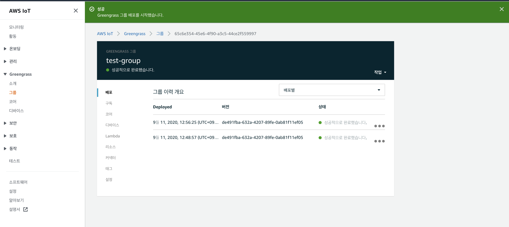
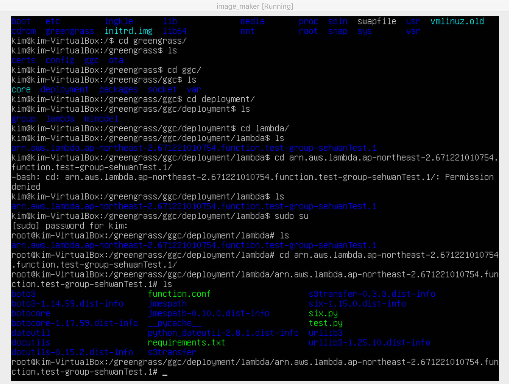
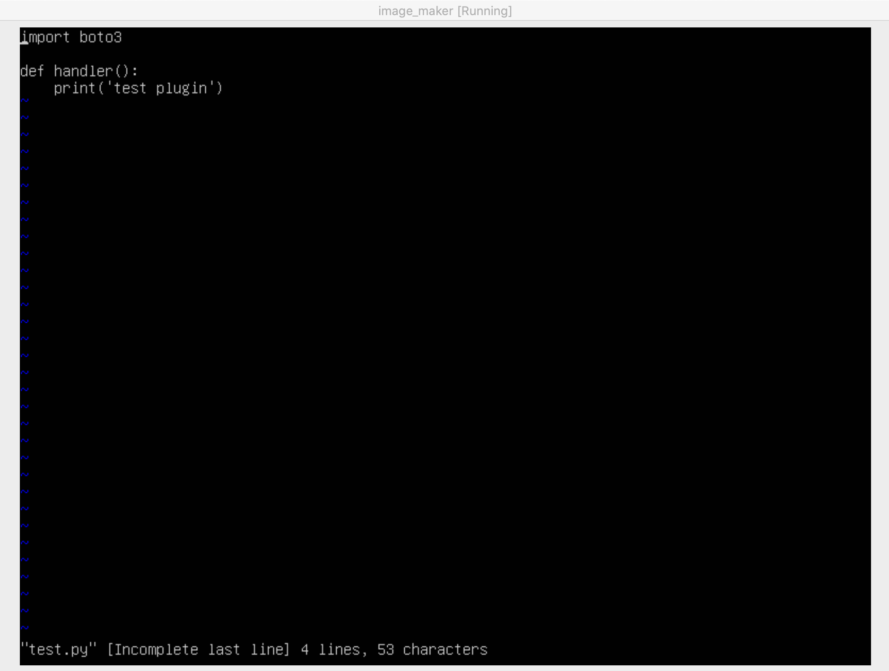

# AWS IoT

* Greengrass & AWS IoT 가 있다.

- Greengrass -> AWS Lambda Resource를 타겟 디바이스에 배포해서 원격 업데이트 및 IoT 서비스가 가능함.

* 내가 생각하는 구조  -> Greengrasss를 이용해 타겟 디바이스에 람다 배포, 이 람다는 mqtt publishing을 하면 될듯.

* greengrass SDK 사용.


## greengrass provisioner 사용법.

* greengrass provisioner란, AWS에서 제공하는 java 기반의 프로그램.

greengrass 서비스를 사용하는 것은 쉽지 않기 때문에 이를 도와주는 유틸리티 프로그램이라고 생각하면 된다.

https://github.com/awslabs/aws-greengrass-provisioner 

https://github.com/aws-samples/aws-greengrass-lambda-functions


우선 aws-greegrass-lambda-functions를 clone 한다.

여기서 중요하게 볼 것들은 ggp.sh (greengrass 코어 소프트웨어를 배포하기 위한 shell-script 파일)
그리고 deployments & functions 디렉터리이다.

deployments 밑에 deployment.defaults.conf 및 function.defaults.conf 파일이 중요하다.


```conf
conf {
  ggds = []
  connectors = []
  core {
    syncShadow = true
    role {
      name = "sehwan-edge-dev-greengrass-core-role"
      alias = "sehwan-dege-dev-greengrass-core-role-alias"
      assumeRolePolicy = {
        Version = "2012-10-17"
        Statement = [
          {
            Effect = "Allow"
            Action = "sts:AssumeRole"
            Principal = {
              Service = "greengrass.amazonaws.com"
            }
          }
          {
            Effect = "Allow"
            Action = "sts:AssumeRole"
            Principal = {
              Service = "credentials.iot.amazonaws.com"
            }
          }
        ]
      }
      iamManagedPolicies = [
        # (Optional): Allows Greengrass Lambdas to write log messages to CloudWatch Logs
        "arn:aws:iam::aws:policy/CloudWatchLogsFullAccess"
        # (Optional): Allows Greengrass Lambdas to write metrics to CloudWatch
        "arn:aws:iam::aws:policy/CloudWatchFullAccess"
        # Allows Greengrass Lambdas to write buffered rawdata to S3
        "arn:aws:iam::aws:policy/AmazonS3FullAccess"
      ]
      iotPolicy = {
        Version = "2012-10-17"
        Statement = [
          {
            Effect = "Allow"
            Action = ["iot:*", "greengrass:*"]
            Resource = ["*"]
          }
        ]
      }
      iamPolicy = {
        Version = "2012-10-17"
        Statement = [
          {
            Effect = "Allow"
            Action = ["iam:GetRole", "iam:PassRole"]
            Resource = ["arn:aws:iam::"${ACCOUNT_ID}":role/"${conf.core.role.name}]
          }
          {
            Effect = "Allow"
            Action = ["cognito-idp:InitiateAuth"]
            Resource = ["*"]
          }
        ]
      }
    }
  }
  lambda {
    role {
      name = "sehwan-edge-dev-greengrass-lambda-role"
      assumeRolePolicy = {
        Version = "2012-10-17"
        Statement = [
          {
            Effect = "Allow"
            Action = "sts:AssumeRole"
            Principal = {
              Service = "lambda.amazonaws.com"
            }
          }
        ]
      }
    }
  }
  service {
    role {
      name = "sehwan-edge-dev-greengrass-service-role"
      assumeRolePolicy = {
        Version = "2012-10-17"
        Statement = [
          # Required: Allows the Greengrass cloud service to assume this role
          {
            Effect = "Allow"
            Action = "sts:AssumeRole"
            Principal = {
              Service = "greengrass.amazonaws.com"
            }
          }
        ]
      }
      iamManagedPolicies = [
        # Required: Role to manage Greengrass resources
        "arn:aws:iam::aws:policy/service-role/AWSGreengrassResourceAccessRolePolicy"
        # (Optional) Additional role to allow the Greengrass cloud service to read S3 resources for ML inference
        "arn:aws:iam::aws:policy/AmazonS3ReadOnlyAccess"
      ]
      iamPolicy = {
        Version = "2012-10-17"
        Statement = [
          # (Optional) Additional permissions to allow the Greengrass cloud service to read secrets and add them to Greengrass deployments
          {
            Effect = "Allow"
            Action = "secretsmanager:GetSecretValue"
            Resource = ["arn:aws:secretsmanager:ap-northeast-2:"${ACCOUNT_ID}":secret:*"]
          }
        ]
      }
    }
  }
  loggers = [
    # This options are related to aws billing.
    # So we need to be careful to enable them.
    #
    #{
    #  component = "GreengrassSystem"
    #  loggerLevel = "INFO"
    #  loggerType = "FileSystem"
    #  # 128 MB
    #  space = 131072
    #}
    #{
    #  component = "GreengrassSystem"
    #  loggerLevel = "INFO"
    #  loggerType = "AWSCloudWatch"
    #}
    {
      component = "Lambda"
      loggerLevel = "INFO"
      loggerType = "FileSystem"
      # 10 MB
      space = 10240
    }
    {
      component = "Lambda"
      loggerLevel = "ERROR"
      loggerType = "AWSCloudWatch"
    }
  ]
}

```

위 설정(deployment.defaults.conf)에서는 greengrass 서비스를 사용하기 위한 iamrole 및 허용 서비스 목록을 지정한다.


다음으로 fucntion.defaults.conf는

```conf
conf {
  aliasName = "ggc"
  encodingType = Json
  connectedShadows = []
  localDeviceResources = []
  localVolumeResources = []
  localS3Resources = []
  localSageMakerResources = []
  localSecretsManagerResources = []
  accessSysFs = false
  memorySizeInKb = 32768
  greengrassContainer = true
  uid = 0
  gid = 0
  environmentVariables = {
    # Envs which is not related to any stage 
    GROUP_ID = ${GROUP_ID}
    AWS_IOT_THING_NAME = ${AWS_IOT_THING_NAME}
    AWS_IOT_THING_ARN = ${AWS_IOT_THING_ARN}
    AWS_GREENGRASS_GROUP_NAME = ${AWS_GREENGRASS_GROUP_NAME}
    #IA_CHANNEL = ""
  }
  #javaJsonHandler = "handleJsonRequest"
  #javaBinaryHandler = "handleBinaryRequest"
}
```

타겟 디바이스에 올라가게 되는 greeengrass Core 에 필요한 셋업들을 지정해주는데. 환경변수 및 어떤 로컬 리소스를 사용하는지 지정한다 -> 로컬 람다의 스펙을 지정해준다고 보면 된다.

그 다음으로 ggp.sh을 간단히 보자면 

```sh
#!/usr/bin/env bash

JAR_NAME="AwsGreengrassProvisioner.jar"
JAR_LOCATION_1="../aws-greengrass-provisioner/build/libs/$JAR_NAME"
JAR_LOCATION_2="./$JAR_NAME"

if [ -f "$JAR_LOCATION_1" ]; then
  JAR_LOCATION=$JAR_LOCATION_1
elif [ -f "$JAR_LOCATION_2" ]; then
  JAR_LOCATION=$JAR_LOCATION_2
fi

if [ ! -z "$JAR_LOCATION" ]; then
  echo "JAR found, running with Java"
  set -e
  java -jar $JAR_LOCATION $@
  exit 0
fi

echo "JAR not found, running with Docker"
TAG=$(cd ../aws-greengrass-provisioner 2>/dev/null && git symbolic-ref --short HEAD | tr -cd '[:alnum:]._-')

if [ $? -ne 0 ]; then
  TAG=master
else
  if [ -z "$TAG" ]; then
    TAG=$(cd ../aws-greengrass-provisioner 2>/dev/null && git rev-parse HEAD)
  fi

  echo Using aws-greengrass-provisioner repo branch $TAG
fi

AWS_CLI_ERROR_MESSAGE_PREFIX="No"
AWS_CLI_ERROR_MESSAGE_SUFFIX="found via aws configure get, do you have the AWS CLI configured on this system? This command does NOT retrieve credentials from EC2 instance metadata."
AWS_CLI_ERROR_EXIT_CODE=1

# Allow failures, we will catch them
set +e

CLI=1
DOCKER_SESSION_TOKEN=""

hash aws 2>/dev/null

if [ $? -ne 0 ]; then
  echo "AWS CLI not installed, looking for credentials via instance metadata service (EC2 only)"
  CLI=0
else
  # Is the AWS CLI configured?
  AWS_ACCESS_KEY_ID=$(aws configure get aws_access_key_id)
fi

if [ $? -ne 0 ] || [ $CLI -eq 0 ]; then
  # AWS CLI is not configured.  Are we running on an EC2 instance with a role?
  ROLE=$(curl -s --connect-timeout 3 http://169.254.169.254/latest/meta-data/iam/security-credentials/)

  if [ $? -ne 0 ]; then
    echo $AWS_CLI_ERROR_MESSAGE_PREFIX access key ID $AWS_CLI_ERROR_MESSAGE_SUFFIX
    exit $AWS_CLI_ERROR_EXIT_CODE
  else
    if [[ $ROLE == \<* ]]; then
      echo This EC2 instance appears to have no role associated with it. You must assign a role to this EC2 instance or provide environment variables with AWS credentials to use this script.
      exit 3
    fi

    # Looks like an EC2 instance with a role, get the credentials
    CREDENTIALS=$(curl -s http://169.254.169.254/latest/meta-data/iam/security-credentials/$ROLE)

    # Extract the credentials
    AWS_ACCESS_KEY_ID=$(echo $CREDENTIALS | sed -e 's/^.*AccessKeyId\" : \"\([^\"]*\).*/\1/')
    AWS_SECRET_ACCESS_KEY=$(echo $CREDENTIALS | sed -e 's/^.*SecretAccessKey\" : \"\([^\"]*\).*/\1/')
    AWS_SESSION_TOKEN=$(echo $CREDENTIALS | sed -e 's/^.*Token\" : \"\([^\"]*\).*/\1/')
    DOCKER_SESSION_TOKEN="-e AWS_SESSION_TOKEN=$AWS_SESSION_TOKEN"

    # Get the region
    AVAILABILITY_ZONE=$(curl -s http://169.254.169.254/latest/meta-data/placement/availability-zone)
    REGION="$(echo \"$AVAILABILITY_ZONE\" | sed 's/[a-z]$//')"
  fi
else
  AWS_SECRET_ACCESS_KEY=$(aws configure get aws_secret_access_key)

  if [ $? -ne 0 ]; then
    echo $AWS_CLI_ERROR_MESSAGE_PREFIX secret access key $AWS_CLI_ERROR_MESSAGE_SUFFIX
    exit $AWS_CLI_ERROR_EXIT_CODE
  fi

  REGION=$(aws configure get region)

  if [ $? -ne 0 ]; then
    echo $AWS_CLI_ERROR_MESSAGE_PREFIX region $AWS_CLI_ERROR_MESSAGE_SUFFIX
    exit $AWS_CLI_ERROR_EXIT_CODE
  fi
fi

# Simple check to make sure docker is installed
hash docker 2>/dev/null

if [ $? -ne 0 ]; then
  echo "Docker may not be installed on your system. If you received a permission denied error try running this script again as root. Otherwise, please install docker and try again."
  exit 2
fi

# All errors after this point are fatal and are handled by OS error messages
set -e

PWD=$(pwd)

docker pull timmattison/aws-greengrass-provisioner:$TAG

TEMP_CONTAINER=$(docker create timmattison/aws-greengrass-provisioner:$TAG)

docker cp $PWD/foundation $TEMP_CONTAINER:/foundation
docker cp $PWD/deployments $TEMP_CONTAINER:/deployments
docker cp $PWD/functions $TEMP_CONTAINER:/functions
docker cp $PWD/connectors $TEMP_CONTAINER:/connectors

TEMP_IMAGE=$(uuidgen | tr '[:upper:]' '[:lower:]' | tr -d '-')

docker commit $TEMP_CONTAINER $TEMP_IMAGE
docker rm $TEMP_CONTAINER

docker run \
  -v $PWD/credentials:/credentials \
  -v $PWD/build:/build \
  -v $HOME/.ssh:/root/.ssh \
  -v $PWD/dtoutput:/dtoutput \
  -v $PWD/logs:/logs \
  -v /var/run/docker.sock:/var/run/docker.sock \
  -i --rm \
  -e AWS_REGION=$REGION \
  -e AWS_ACCESS_KEY_ID=$AWS_ACCESS_KEY_ID \
  -e AWS_SECRET_ACCESS_KEY=$AWS_SECRET_ACCESS_KEY \
  $DOCKER_SESSION_TOKEN \
  $TEMP_IMAGE $@
```

나는 docker 환경에서 사용한다. docker가 배포 프로세스를 돌리는 디바이스에 설치 되어 있어야 한다.

그래서 최종적으로 디렉터리 구성은 다음과 같이 되어있어야 한다.

```
build/
connector/
credential/
deployments/
    - deloyment.defaults.conf
    - empty.conf
    - function.defaults.conf
    -배포할라는람다리스트넣은것.conf
foundation/
functuons/
    - 배포할라는 람다코드
    - requirements.txt
    - functuon.conf
ggp.sh
serverless.yml
```
이와 같은 구조로 되어있어야 한다.

serverless.yml은 로컬에 배포할 lambda를 배포해서 담아두는 버킷을 생성한다고 생각하면 된다.

`deployments/` 디렉터리에서 람다 리스트를 넣은 conf파일의 구조는 다음과 같다

```conf
conf {
  functions = [
    "sehwanTest"
  ]
}
```

이렇게 배포할라는 람다 함수의 리스트를 넣으면 됩니다.

이렇게 구현 한뒤 greengrass 를 배포하는 방법은

`./ggp.sh -g test-group -a X86_64 -d deployments/test.conf --script`

을 이용해서 배포하면 되고 greengrass 소프트 웨어 설치를 위한 부트스트랩 파일은 build 디렉터리에 담기게 되는데,
ggp.sh 인자로 --s3-directory 를 넣어주면 s3 버킷에도 담기게 된다고 합니다.

이렇게 생성된 부트스트랩 파일 `gg.test-group.sh` 을 타겟 디바이스에 담아서 실행하면 끝.




실제 리눅스 virtual machine 위에 올린 모습



`/greengrass/ggc/deployment/lamda/arn. ~~~~/`

에 본인이 배포한 람다 코드가 들어있다.

내가 로컬에서 작성한 파이썬 람다 코드(예시..)
```python3
import boto3

def handler():
    print('test plugin')
```

실제 배포 된 모습



동일하다.