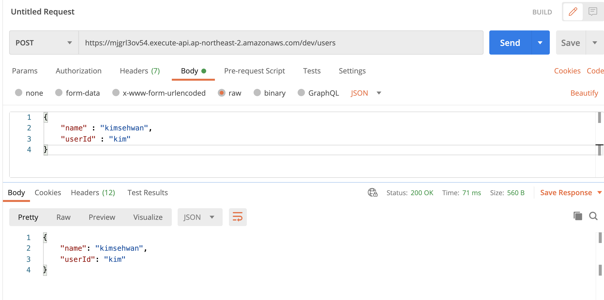
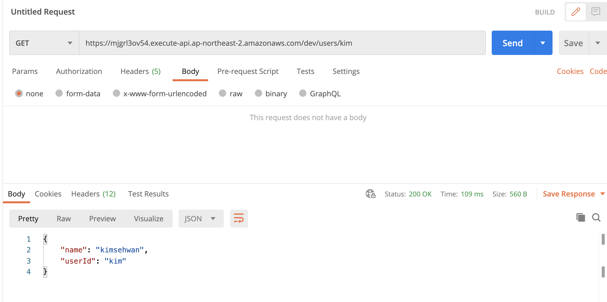

# Rest API with flask

- 일반적인 구조의 람다 rest api 코드는 python lambda handler로부터 arguments를 받아
- 해당 인자들을 받아서 필요한 로직을 수행 한 후 리턴을 해준다.
- 기존 파이썬 람다는 serverless에서 get, post, put, update에 대한 각 로직을 분리해주어야 하는데 
- flask를 이용할 경우 어떤 method든 우선 http 요청을 받아서 flask `@app.route` 데코레이터를 이용해 분리


## 궁금 한 점
- 과연 flask 기반의 람다가 production 환경에서 잘 돌아갈까? (퍼포먼스 이슈)
- 테스트 해보고 잘 되면 괜찮은 접근 같다. 
- 일일이 pathparameter 및 query parameter를 serverless 템플릿에서 분리 안해도 되니까?


## deep dive !

```python3
import os

import boto3

from flask import Flask, jsonify, request
app = Flask(__name__)

#boto3로 접근할 테이블 정의
USERS_TABLE = os.environ['USERS_TABLE']
client = boto3.client('dynamodb')


@app.route("/")
def hello():
    return "Hello World!"

#https://mjgrl3ov54.execute-api.ap-northeast-2.amazonaws.com/dev/ 로 접근하면 헬로월드 보임


#path parameter로 userid를 넣어주면, 해당 유저에 대해서
#dynamodb를 접근해서 데이터를 뺴온당
#부분키를 대상으로 접근!
@app.route("/users/<string:user_id>")
def get_user(user_id):
    resp = client.get_item(
        TableName=USERS_TABLE,
        Key={
            'userId': { 'S': user_id }
        }
    )
    item = resp.get('Item')
    if not item:
        return jsonify({'error': 'User does not exist'}), 404

    return jsonify({
        'userId': item.get('userId').get('S'),
        'name': item.get('name').get('S')
    })


# /users로 post method를 사용해 Json 던져주면
# dynamoDB 에 잘 까서 넣는다 !
@app.route("/users", methods=["POST"])
def create_user():
    user_id = request.json.get('userId')
    name = request.json.get('name')
    if not user_id or not name:
        return jsonify({'error': 'Please provide userId and name'}), 400

    resp = client.put_item(
        TableName=USERS_TABLE,
        Item={
            'userId': {'S': user_id },
            'name': {'S': name }
        }
    )

    return jsonify({
        'userId': user_id,
        'name': name
    })

```


<strong> /users로 post method를 통해 DB에 값 삽입 </strong>



<strong> /users/userId로 gert method를 통해 DB에 있는 값 불러오기! </strong>


### requirments.txt

- 파이썬 람다를 배포할때, 람다는 컨테이너 환경에서 실행되기 때문에 무조건 requirements.txt를 명시해서
- 람다가 배포 될 때 설치되게 해야 한다.
- 꿀팁!
    - `$ virtualenv venv --python=python3`
    - `$ source venv/bin/activate`
    - 상기 두개를 해서 가상 환경 만든 뒤에
    - `$ pip install flask`
    - `$ pip freeze > requirments.txt`
    - 이렇게하면 requirements.txt에 모든 필요한 패키지 목록 나온당~!