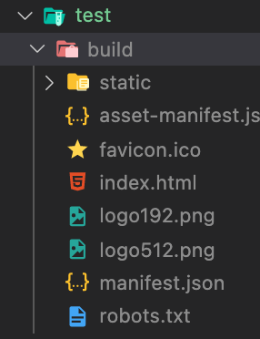
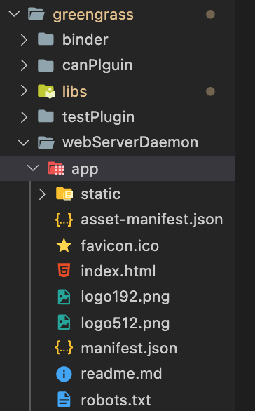
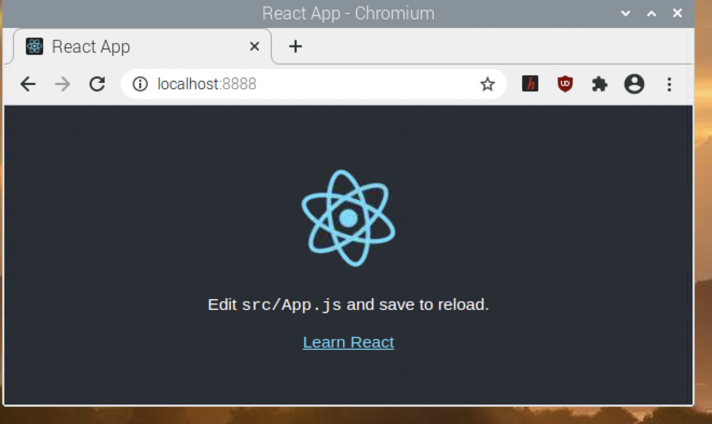

# 모니터링 앱 로컬 버전 테스트

## 구조

greengrass lambda 중 `webserverDaemon`이 html, css, js등 정적 파일을 로컬호스트로 호스팅 가능하다.

이 디렉터리에서 빌드한 리액트 앱을 /greengrass/webserverDaemon/app 디렉터리에 넣어서 테스트해보자.

## 순서

로컬에서 제공하고자 하는 리액트 앱을 빌드한다.

build/ 디렉터리의 내용을 /greengrass/webserverDaemon/app 디렉터리에 넣는다.

greengrass 람다 배포를 해서 확인한다.

잘 된다!
