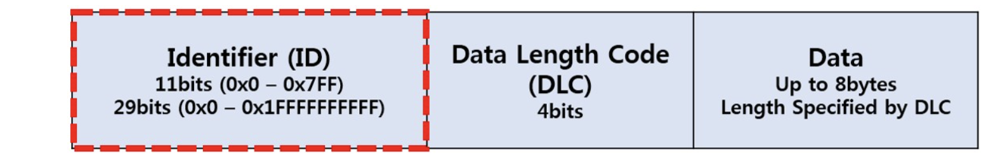
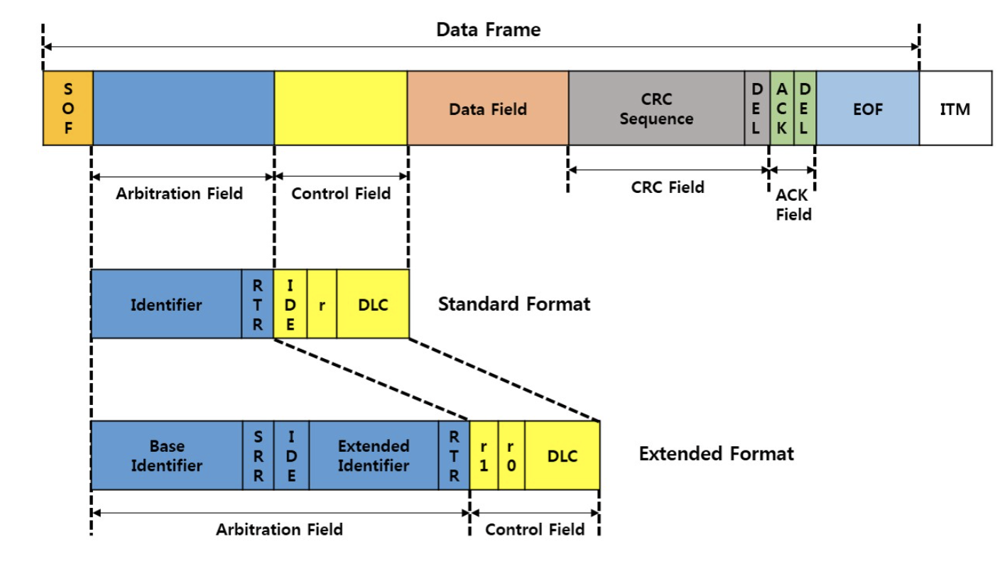
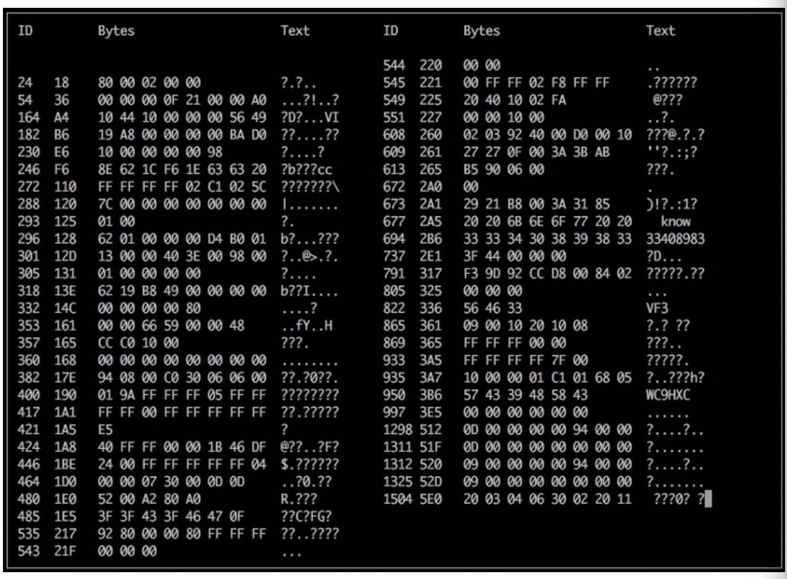
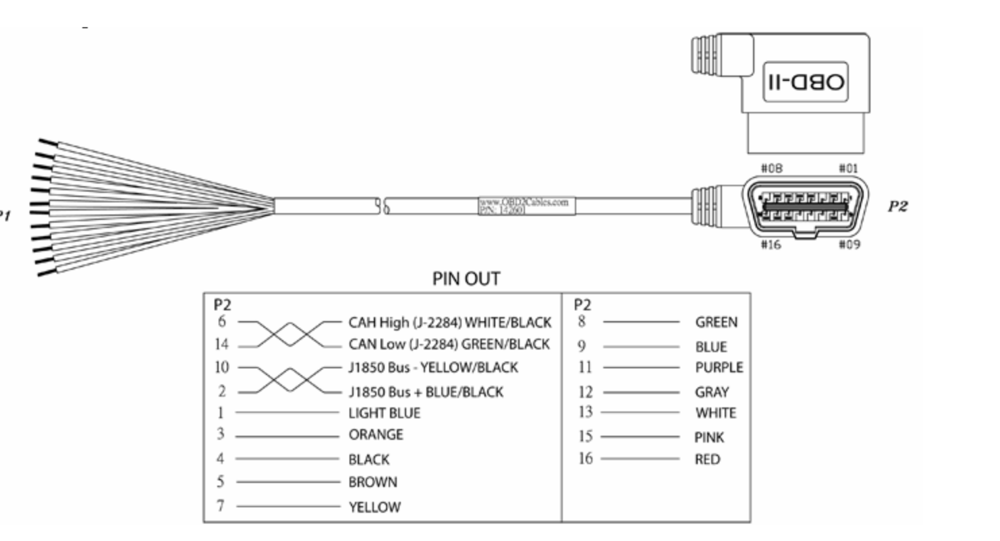

# CAN , OBD 에 대한 내용 정리.

## CAN?
- CAN (Controller Area Network), 호스트 컴퓨터 없이 각종 제어기나 장치들이 서로 통신하기 위해 설계된 표준 통신 규격
- 차량 내 ECU들은 CAN을 이용하여 통신함.

## 특징
1. 메시지 지향성 프로토콜
    - CAN은 노드의 주소에 의해 데이터가 교환되는 것이 아니라
    - 메시지의 우선순위에 따라 ID를 할당

2. 전기적 노이즈에 강함
    - CAN_H, CAN_L 꼬인 2선식 통신을 하기 때문에 노이즈에 강함

## CAN BUS 네트워크 동작 원리

- 메시지의 첫 부분에 ID를 갖고있고, 그 뒤에 DLC(Data Length Code), 그 뒤에 Data가 들어오는 구조 (최대 8Bytes)

## 통신 프로토콜

1. CAN 규격
- ID의 길이에 따라 두가지 모드로 구분된다.

    1. 표준 CAN 2.0A : 11비트 식별자
    2. 표준 CAN 2.0B : 29비트 식별자

    1. ISO 11898: 1Mbps 이상의 고속 통신
    2. ISO 11519: 125Kbps 까지의 통신

2. CAN 메시지 포멧 구조

## 간단한 개념
1. 메시지 지향성 프로토콜 이기 때문에...
    - 특정한 ID에 특정한 값을 담아 놓을테니, 알아서 읽어가라 라는 개념
    - 즉 우리는 어떤 데이터가 어떤 ID와 매칭되는지만 정확히 알고 있다면(차종별로)
    - 우리가 원하는 데이터들만 받을 수 있다.

2. OBD
- 물리적으로는 CAN과 똑같지만, 원하는 데이터를 받고 싶다고 데이터 쿼리(요청)을하면 그것을 돌려주는 컨셉이다.

3. OBD의 한계 및 CAN 접근 해야하는 이유
    - OBD통신은 일단 매우 느리다.
    - CAN모니터링이 통신에 대한 부담이 적다(CAN Network에 대해서)
        - 왜? OBD처럼 데이터 쿼리를 하지 않으니까.
    - CAN은 거의 Realtime 수준으로 반응한다.

4. 확인 할 수 있는 값들?
    - 계기판에서 보는 대부분의 값
    - 차량에 센서가 달려있는 값
    - 차량에 달려있는 제어기로부터 받는 값
        - ECU (엔진 속도, 엔진 스로틀, 수온, 연료잔량)
        - ABS (4바퀴 각각의 속도, 브레이크 밟은 정도)
        - MDPS (핸들 꺾은 각도)
        - TPMS (4바퀴의 각각의 공기압)

- 실제 데이터 모니터링 예

### 우리가 가야할 컨셉 !

- ISO 11898 규격의 CAN protocol 이용 할 것.
- CAN H/L 신호는 OBD 단자와 연결해서 받을 것 (OBD 통신을 하진 않을 것 !)

- 다만 OBD단자를 이용 할 것이기 때문에, OBD단자 커넥터가 필요하다.
    - 케이블을 구매하자 !

- OBD 단자의 D-CAN High, Low 신호가 CAN H,L 신호다.

- 한쪽은 OBD 커넥터, 한쪽은 Dsub(9 pin)커넥터를 달아서 커스텀 커넥터를 만들자. 

- 자동차 OBD 메뉴얼을 확인하여 결선하는 것이 중요함
    - 의문점 : 같은 차 메이커 모든 차종들이 똑같은 OBD pin map을 갖는가?

### 개발 시나리오.

1. PICAN raspberry pi 쉴드 이용
    - PICAN 쉴드는 CAN Controller, Receiver가 내장되어있고, 기존 Raspberry pi 3B GPIO와 직접 연결이 되는데
    - SPI 가 GPIO에 맞게 연결이 가능하기 때문에, 우선 개발에 집중 할 수 있다.
    - 따라서 PICAN을 이용해 Python-can 모듈을 사용한 개발을 통해서 우선 테스트 한다.

2. CAN  simulation?
    - CAN을 자동차와 직접 시뮬레이션 하는 것도 좋지만 우선 시뮬레이터가 있어야 한다.
    - 시뮬레이터 가격은 약 40만원 -> 창업지원단에 해당 내용 시제품 제작비용으로 들어 갈 수 있을지 문의해본다.

3. 개발은 어떻게?
    - PICAN을 이용해 CAN protocol을 이용하여 실제 차량의 속도, 엔진 정보, 핸들 각도 등등의 데이터를 수집이 가능한지 테스트.
    - 캔 통신의 특성상 데이터와 ID가 1:1 맵핑 관계를 이루고, 이것들이 차량마다 다르기 때문에 우선 내차 (2019 K3)에서 데이터를 수집하고 맵핑한다.
    - 맵핑 자료를 갖고 특정 Json파일을 생성, 이 json파일을 이용해 앞으로 CAN에서의 Data ID와 실제 데이터명을 맵핑하는 로직을 구성한다.
    - 이를 DynamoDB에 Json 형태로 저장해서 추후 확장 가능하게 구현한다.
    - CAN을 통해 실제 데이터를 수집하는 코드를 구현한 이후에는 클라우드 상 S3 및 라즈베리파이에 CSV 데이터를 저장하는 로직을 구성한다.
    - AWS Lambda를 이용하여 주기적으로 쌓인 csv파일을 기반으로 통계 데이터를 만든다.
    - 추후 실시간으로 올라오는 데이터를 IoT Rule 혹은 람다를 이용하여 운전 패턴 분석 모델을 만든다.
    - 이러한 운전 패턴 분석 데이터 및 통계 데이털을 Front Code에 전달할 API를 구성한다.

4. 하드웨어 개발은?
    - 우선 소프트웨어를 구성한 이후에
    - CAN Controller (MCP2515) 및 CAN Receiver (아직미정) + LTE 모뎀 칩 + Raspberry pi를 모두 하나의 보드로 디자인하는 작업이 필요하다.
    - 디지털 회로설계에 대한 내용이 포함되므로 이를 외주를 맡길지, 자체적으로 해결할지는 미지수
    - 창업지원단의 시제품 제작비를 활용하여 제작하는것을 목표로 한다.
    